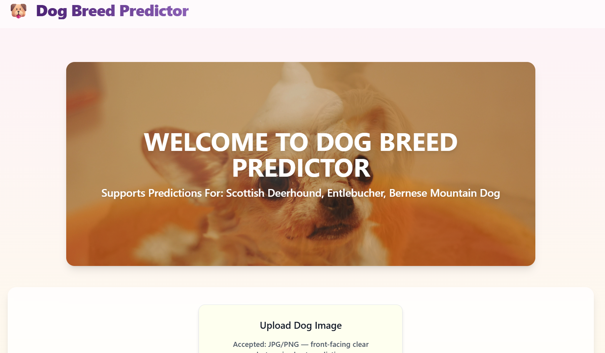
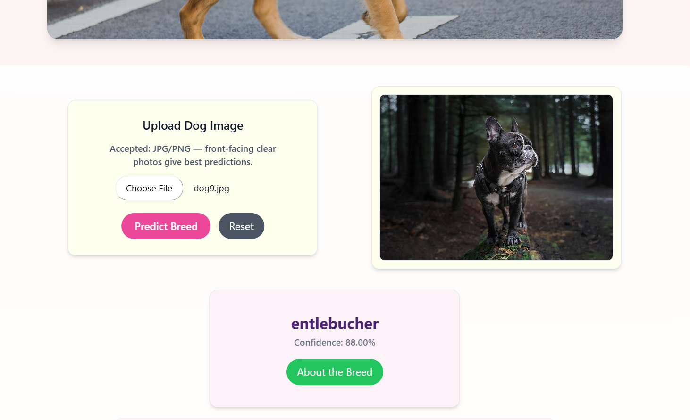

🐶 Dog Breed Predictor

An AI-powered web application that predicts dog breeds from dog images using a trained CNN deep learning model.
Built with Django (backend) and HTML, CSS, Tailwind CSS, JavaScript (frontend).

🔗 GitHub Repository:
https://github.com/ayushi501/Dog-Breed-Predictor.git

🚀 Features

🖼️ Upload any dog image

🔍 AI model predicts the breed

📊 Confidence score

⚠️ Low-confidence warning message

🎨 Clean UI built with Tailwind CSS

🖥️ Real-time preview before upload

🐾 Background slideshow with dog images

🔑 Environment-based configuration using .env (DEBUG, API keys)

🧠 Dataset Information

The dataset used for this project was taken from Kaggle, titled:

📦 Dataset: dogbreedidfromcomp
Kaggle Link: https://www.kaggle.com/datasets/catherinehorng/dogbreedidfromcomp

Why this dataset?

It contains labeled dog breed images

Perfect for beginner-friendly CNN model building

Due to limited computation power, only a small subset was used for training

🤖 Model Details

Model Type: Sequential CNN

Framework: TensorFlow / Keras

Saved Model File: dog_breed_predictor.keras

Accuracy Achieved: ~50% (due to small dataset size)

Predicted Dog Breeds (3 classes):

['scottish_deerhound', 'entlebucher', 'bernese_mountain_dog']

Reason for lower accuracy

Limited GPU/CPU power

Small subset of the dataset used

Model is intentionally lightweight for fast prediction

🛠️ Tech Stack
Backend

Django

Python

Keras / TensorFlow

Frontend

HTML

Tailwind CSS

Vanilla JavaScript

APIs Used

Google Gemini API (for generating descriptions/messages or additional info)

📂 Project Structure
Dog-Breed-Predictor/
├── predictor/    
│      ├── admin.py
│      ├── utils.py  
│      ├── views.py
│      └── urls.py
│
├── templates/
├── static/
│      ├── css/
│      ├── js/
│      └── images/
│
├── model/
│      └── uploads/
│
├── dog_breed_predictor.keras
├── manage.py
├── .env
├── db.sqlite3
└── README.md

⚙️ Environment Variables (Required)

Create a .env file in the project root:

DEBUG=True
SECRET_KEY=your_secret_key
GEMINI_API_KEY=your_gemini_api_key

In settings.py:

DEBUG = os.getenv("DEBUG") == "True"

📥 Installation & Setup
1️⃣ Clone the project
git clone https://github.com/ayushi501/Dog-Breed-Predictor.git
cd Dog-Breed-Predictor

2️⃣ Create and activate virtual environment
python -m venv venv
venv/Scripts/activate      # Windows
source venv/bin/activate   # Linux/Mac

3️⃣ Install dependencies
pip install -r requirements.txt

4️⃣ Add a .env file (see above)
5️⃣ Apply migrations
python manage.py migrate

6️⃣ Run the server
python manage.py runserver

Open: http://127.0.0.1:8000/

🔮 Scope of the Project

This project demonstrates the complete workflow of building a small-scale AI system:

Dataset extraction from Kaggle

Preprocessing and augmentation

Model creation using CNN

Training on limited hardware resources

Making predictions through a Django web interface

🛠️ Future Improvements

Hyperparameter tuning

Training on a much larger dataset

Increasing the number of dog breeds

Improving accuracy with deeper architectures (ResNet, MobileNet, EfficientNet)

Adding API support for mobile apps

Real-World Uses

This system can be used:

By animal NGOs for breed identification

For educational purposes in ML learning

As a starting point for a full-scale pet classification system

📸 Screenshots

🚀 Deployment Tips
When DEBUG=False, ensure:
ALLOWED_HOSTS = ["*"]

Collect static files:
python manage.py collectstatic

❤️ Author

Ayushi Singh
CSE Graduate-2025 | Python Developer | AI / ML Enthusiast